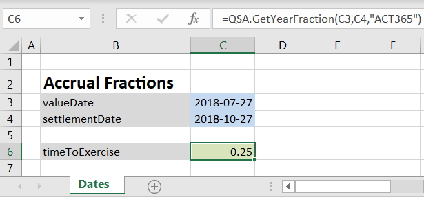
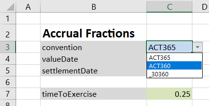
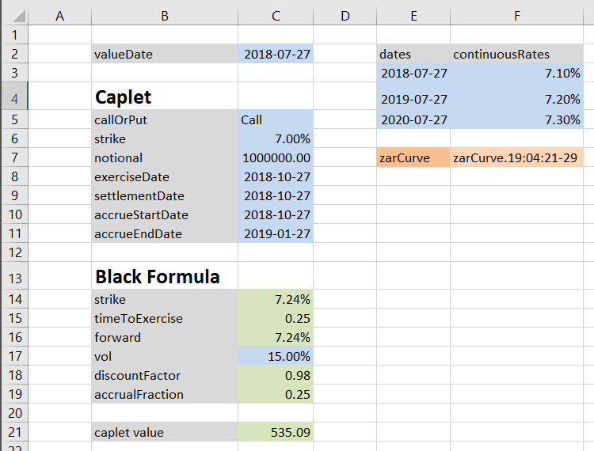

# Create Excel Workbooks from Markdown

## Overview

This library allows you to write plain text documents that can be converted to 
excel workbooks. The main advantages of this are:

 * you can modify the format of published sheets at anytime
 * the contents of workbooks can be properly managed in your source control system
 * the structure and format of all your workbooks is standardized
 
## Uses

This library has been written to allow [QuantSA](www.QuantSA.org) to replace its 
example workbooks with markdown versions that will lead to more standardized 
structures and better source control.  The examples below use functions from QuantSA
but this tool can easily be used for any other library.

## Example

As an example of how this works; if you want an example sheet that demonstrates
how to get an accrual fraction you would write a text file with:

```
# Dates

[B2]
## Accrual Fractions
valueDate,2018-07-27
settlementDate,2018-10-27

timeToExercise,=QSA.GetYearFraction(valueDate,settlementDate,"ACT365")[0.00]
```

and after generating the workbook you would obtain:



Note how the arguments in the function call has been replaced with cell references that
were not known at the time of writing the markdown.

### Explanation

We can look at each row of the markdown to see what it does:

|markdown|explanation|
|---|---|
|```# Dates```|Starts a new tab with this name|
|||
|```[B2]```|The contents below this will be inserted from cell B2|
|```## Accrual Fractions```|Add a heading|
|```valueDate, 2018-07-27```|Add a date, give a name to the date for use in formulas below |
|```settlementDate, 2018-10-27```||
|``` ```| Adds blank row in the spreadsheet|
|```timeToExercise, =QSA.GetYearFraction(valueDate, settlementDate, "ACT365")[0.00]```| Call a function using the values defined above. The final [0.00] is the excel format for the output. Any valid excel format is supported.|

### Adding a drop down
The tiny example can be extended by making a dropdown available for the daycount convention as follows:

```
# Dates

[B2]
## Accrual Fractions
convention,[ACT365,ACT360,_30360]ACT365
valueDate,2018-07-27
settlementDate,2018-10-27

timeToExercise,=QSA.GetYearFraction(valueDate,settlementDate,convention)[0.00]
```

which produces:




## Bigger Example

Several useful features are supported at the moment and these can be seen in 
[caplet.md](https://raw.githubusercontent.com/JamesLTaylor/xls_markdown/master/caplet.md) which produces:


